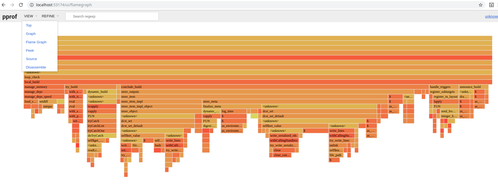

# Profiling studies

The goal is to identify and reduce `drake`'s overhead.

# System requirements

## Software

1. Packages in `R/packages.R`. Windows users can skip `jointprof`. 
2. [Go](https://golang.org)
3. [`pprof`](https://github.com/google/pprof). 
4. [Graphviz](https://graphviz.gitlab.io/download/)

## Environment variables

1. `GOPATH`. See the Go documentation for details.
2. `PATH`. Must include the file paths to the executables of `pprof` and Graphviz.

# Usage

1. Run one of the workflow scripts in the section below.
2. Look for the URL in the console messages, e.g. `local pprof server: http://localhost:50982`.
3. Navigate a browser to the URL you found, e.g. `http://localhost:50982`.
4. Navigate to the flame graph ("view" menu on the upper left) and look for bottlenecks. Click and hover to interact with the graph.

# Workflows

- `connected.R`: a plan with a highly connected graph.
- `makefile.R`: like `connected.R`, but with a `Makefile` instead of `drake`.
- `dynamic.R`: dynamic branching with many sub-targets.
- `static.R`: static branching comparison for `dynamic.R`.
